# PSoC&trade; 4: CAPSENSE&trade; multi-frequency scan

This code example demonstrates the use of the multi-frequency scan (MFS) for PSoC&trade; 4 CAPSENSE&trade; applications to prevent false touch detection in the presence of external noise. This code example demonstrates this feature for both CSD (self-capacitance) and CSX (mutual-capacitance) designs.

[View this README on GitHub.](https://github.com/Infineon/mtb-example-psoc4-capsense-multi-frequency-scan)


[Provide feedback on this code example.](https://yourvoice.infineon.com/jfe/form/SV_1NTns53sK2yiljn?Q_EED=eyJVbmlxdWUgRG9jIElkIjoiQ0UyMzc2ODciLCJTcGVjIE51bWJlciI6IjAwMi0zNzY4NyIsIkRvYyBUaXRsZSI6IlBTb0MmdHJhZGU7IDQ6IENBUFNFTlNFJnRyYWRlOyBtdWx0aS1mcmVxdWVuY3kgc2NhbiIsInJpZCI6ImdhdXRhbS5yYWphbm5hQGluZmluZW9uLmNvbSIsIkRvYyB2ZXJzaW9uIjoiMS4xLjEiLCJEb2MgTGFuZ3VhZ2UiOiJFbmdsaXNoIiwiRG9jIERpdmlzaW9uIjoiTUNEIiwiRG9jIEJVIjoiSUNXIiwiRG9jIEZhbWlseSI6IlBTT0MifQ==)

## Requirements

- [ModusToolbox&trade;](https://www.infineon.com/modustoolbox) v3.1 or later (tested with v3.1)
- [ModusToolbox&trade; CAPSENSE&trade; and Multi-Sense Pack](https://softwaretools.infineon.com/tools/com.ifx.tb.tool.modustoolboxpackmultisense) for [ModusToolbox&trade;](https://www.infineon.com/modustoolbox) v3.7 or later
- Board support package (BSP) minimum required version: 3.1.0
- Programming language: C
- Associated parts: [PSoC&trade; 4000S, PSoC&trade; 4100S Plus, PSoC&trade; 4100S Max, PSoC&trade; 4500S, and PSoC&trade; 4000T](https://www.infineon.com/cms/en/product/microcontroller/32-bit-psoc-arm-cortex-microcontroller/psoc-4-32-bit-arm-cortex-m0-mcu/)

## Supported toolchains (make variable 'TOOLCHAIN')

- GNU Arm&reg; Embedded Compiler v11.3.1 (`GCC_ARM`) - Default value of `TOOLCHAIN`
- Arm&reg; Compiler v6.16 (`ARM`)
- IAR C/C++ Compiler v9.30.1 (`IAR`)

## Supported kits (make variable 'TARGET')

- [PSoC&trade; 4100S MAX Prototyping Kit](https://www.infineon.com/CY8CKIT-041S-MAX) (`CY8CKIT-041S-MAX`) - Default value of `TARGET`
- [PSoC&trade; 4000S CAPSENSE&trade; Prototyping Kit](https://www.infineon.com/CY8CKIT-145-40XX) (`CY8CKIT-145-40XX`)
- [PSoC&trade; 4100S Plus Prototyping Kit](https://www.infineon.com/CY8CKIT-149) (`CY8CKIT-149`)
- [PSoC&trade; 4500S Pioneer Kit](https://www.infineon.com/CY8CKIT-045S) (`CY8CKIT-045S`)
- [PSoC&trade; 4000T CAPSENSE&trade; Prototyping Kit](https://www.infineon.com/CY8CPROTO-040T) (`CY8CPROTO-040T`)

## Hardware setup

This example uses the board's default configuration. See the kit guide to ensure that the board is configured correctly.

- For [CY8CKIT-045S](https://www.infineon.com/CY8CKIT-045S), populate the resistor R57 in order to inject the external noise to pin P4[4] of the extended header J10. For more details, see the **Rework on CapSense and Additional Multiplexed Pins** section in the [kit guide](https://www.infineon.com/dgdl/Infineon-CY8CKIT-045S_PSoC_4500S_Pioneer_Kit_Guide-UserManual-v01_00-EN.pdf?fileId=8ac78c8c7d0d8da4017d0f0314d21a51).

> **Note:** Some of the PSoC&trade; 4 kits ship with KitProg2 installed. ModusToolbox&trade; requires KitProg3. Before using this code example, make sure that the board is upgraded to KitProg3. The tool and instructions are available in the [Firmware Loader](https://github.com/Infineon/Firmware-loader) GitHub repository. If you do not upgrade, you will see an error like "unable to find CMSIS-DAP device" or "KitProg firmware is out of date".

## Software setup

This example requires no additional software or tools.

## Using the code example

### Create the project

The ModusToolbox&trade; tools package provides the Project Creator as both a GUI tool and a command line tool.

<details><summary><b>Use Project Creator GUI</b></summary>

1. Open the Project Creator GUI tool.

   There are several ways to do this, including launching it from the dashboard or from inside the Eclipse IDE. For more details, see the [Project Creator user guide](https://www.infineon.com/ModusToolboxProjectCreator) (locally available at *{ModusToolbox&trade; install directory}/tools_{version}/project-creator/docs/project-creator.pdf*).

2. On the **Choose Board Support Package (BSP)** page, select a kit supported by this code example. See [Supported kits](#supported-kits-make-variable-target).
   > **Note:** To use this code example for a kit not listed here, you may need to update the source files. If the kit does not have the required resources, the application may not work.

3. On the **Select Application** page:

   a. Select the **Applications(s) Root Path** and the **Target IDE**.

   > **Note:** Depending on how you open the Project Creator tool, these fields may be pre-selected for you.

   b.	Select this code example from the list by enabling its check box.

   > **Note:** You can narrow the list of displayed examples by typing in the filter box.

   c. (Optional) Change the suggested **New Application Name** and **New BSP Name**.

   d. Click **Create** to complete the application creation process.

</details>

<details><summary><b>Use Project Creator CLI</b></summary>

The 'project-creator-cli' tool can be used to create applications from a CLI terminal or from within batch files or shell scripts. This tool is available in the *{ModusToolbox&trade; install directory}/tools_{version}/project-creator/* directory.

Use a CLI terminal to invoke the 'project-creator-cli' tool. On Windows, use the command-line 'modus-shell' program provided in the ModusToolbox&trade; installation instead of a standard Windows command-line application. This shell provides access to all ModusToolbox&trade; tools. You can access it by typing "modus-shell" in the search box in the Windows menu. In Linux and macOS, you can use any terminal application.

The following example clones the "mtb-example-psoc4-capsense-multi-frequency-scan" application with the desired name "CapsenseMFS" configured for the CY8CKIT-041S-MAX BSP into the specified working directory, C:/mtb_projects:

   ```
   project-creator-cli --board-id CY8CKIT-041S-MAX --app-id mtb-example-psoc4-capsense-multi-frequency-scan --user-app-name CapsenseMFS --target-dir "C:/mtb_projects"
   ```

The 'project-creator-cli' tool has the following arguments:

Argument | Description | Required/optional
---------|-------------|-----------
`--board-id` | Defined in the <id> field of the [BSP](https://github.com/Infineon?q=bsp-manifest&type=&language=&sort=) manifest | Required
`--app-id`   | Defined in the <id> field of the [CE](https://github.com/Infineon?q=ce-manifest&type=&language=&sort=) manifest | Required
`--target-dir`| Specify the directory in which the application is to be created if you prefer not to use the default current working directory | Optional
`--user-app-name`| Specify the name of the application if you prefer to have a name other than the example's default name | Optional

> **Note:** The project-creator-cli tool uses the `git clone` and `make getlibs` commands to fetch the repository and import the required libraries. For details, see the "Project creator tools" section of the [ModusToolbox&trade; tools package user guide](https://www.infineon.com/ModusToolboxUserGuide) (locally available at {ModusToolbox&trade; install directory}/docs_{version}/mtb_user_guide.pdf).


</details>

### Open the project

After the project has been created, you can open it in your preferred development environment.

<details><summary><b>Eclipse IDE</b></summary>


If you opened the Project Creator tool from the included Eclipse IDE, the project will open in Eclipse automatically.

For more details, see the [Eclipse IDE for ModusToolbox&trade; user guide](https://www.infineon.com/MTBEclipseIDEUserGuide) (locally available at *{ModusToolbox&trade; install directory}/docs_{version}/mt_ide_user_guide.pdf*).

</details>


<details><summary><b>Visual Studio (VS) Code</b></summary>

Launch VS Code manually, and then open the generated *{project-name}.code-workspace* file located in the project directory.

For more details, see the [Visual Studio Code for ModusToolbox&trade; user guide](https://www.infineon.com/MTBVSCodeUserGuide) (locally available at *{ModusToolbox&trade; install directory}/docs_{version}/mt_vscode_user_guide.pdf*).

</details>


<details><summary><b>Keil µVision</b></summary>

Double-click the generated *{project-name}.cprj* file to launch the Keil µVision IDE.

For more details, see the [Keil µVision for ModusToolbox&trade; user guide](https://www.infineon.com/MTBuVisionUserGuide) (locally available at *{ModusToolbox&trade; install directory}/docs_{version}/mt_uvision_user_guide.pdf*).

</details>

<details><summary><b>IAR Embedded Workbench</b></summary>

Open IAR Embedded Workbench manually, and create a new project. Then select the generated *{project-name}.ipcf* file located in the project directory.

For more details, see the [IAR Embedded Workbench for ModusToolbox&trade; user guide](https://www.infineon.com/MTBIARUserGuide) (locally available at *{ModusToolbox&trade; install directory}/docs_{version}/mt_iar_user_guide.pdf*).

</details>

<details><summary><b>Command line</b></summary>


If you prefer to use the CLI, open the appropriate terminal, and navigate to the project directory. On Windows, use the command-line 'modus-shell' program; on Linux and macOS, you can use any terminal application. From there, you can run various `make` commands.

For more details, see the [ModusToolbox&trade; tools package user guide](https://www.infineon.com/ModusToolboxUserGuide) (locally available at *{ModusToolbox&trade; install directory}/docs_{version}/mtb_user_guide.pdf*).

</details>


## Operation

1. Connect the board to your PC using the provided USB cable through the KitProg3 USB connector.

2. Program the board using one of the following:

   <details><summary><b>Using Eclipse IDE</b></summary>

      1. Select the application project in the Project Explorer.

      2. In the **Quick Panel**, scroll down, and click **\<Application Name> Program (KitProg3_MiniProg4)**.

   </details>

   <details><summary><b>In other IDEs</b></summary>

   Follow the instructions in your preferred IDE.

   </details>

   <details><summary><b>Using CLI</b></summary>

     From the terminal, execute the `make program` command to build and program the application using the default toolchain to the default target. The default toolchain is specified in the application's Makefile but you can override this value manually:
      ```
      make program TOOLCHAIN=<toolchain>
      ```

      Example:
      ```
      make program TOOLCHAIN=GCC_ARM
      ```

   </details>

3.  Touch the CAPSENSE&trade; buttons and observe that the corresponding LEDs turn ON.

4. Slide your finger over the CAPSENSE&trade; linear slider and observe that the LED1 turns ON.

5. To monitor CAPSENSE&trade; raw data using the Sense Tuner GUI, launch the tuner from the **Quick Panel**, as shown in Figure 1.

      **Figure 1. Quick Panel**

      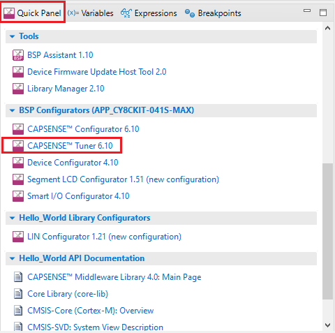

      See the "Launch the CAPSENSE&trade; tuner" section from the [ModusToolbox&trade; CAPSENSE&trade; tuner guide](https://www.infineon.com/ModusToolboxCapSenseTuner).

6. Go to **Tools** > **Tuner Communication Setup** and set the parameters as shown in Figure 2, then click **OK**.

      **Figure 2. Tuner Communication Setup**

      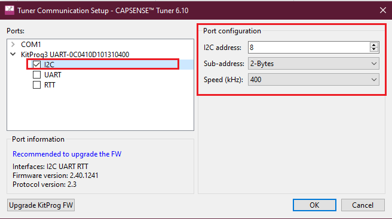

7. Click **Connect**.

      **Figure 3. CAPSENSE&trade; tuner window**

      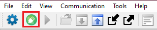

8. Click **Start**.

      **Figure 4. CAPSENSE&trade; tuner start**

      

      The **Widget/Sensor Parameters** tab gets updated with the parameters configured in the **CAPSENSE&trade; Configurator** window.

      **Figure 5. CAPSENSE&trade; Widget View**

      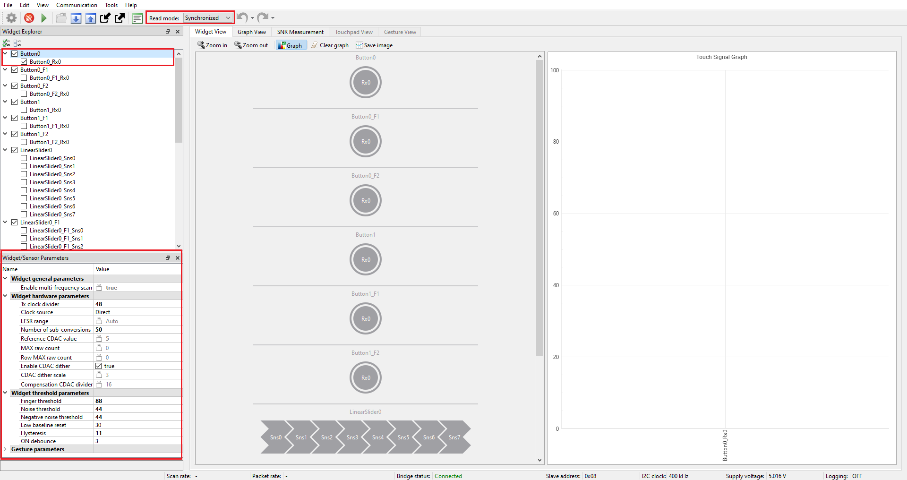

9. Observe from the Widget/Sensor parameters section in the CAPSENSE&trade; tuner window that the CAPSENSE&trade; peripheral calculates three different Compensation/Modulator IDAC values for each of the channels, as shown in Figure 6 and Figure 7.

      **Figure 6. Three different Compensation IDAC values for the CSX Button**

      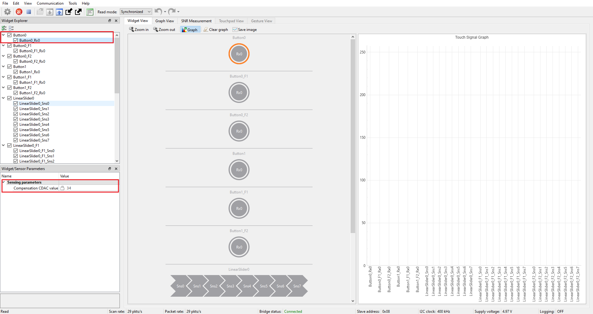

      **Figure 7. Three different Compensation IDAC values for the CSD linear slider**

      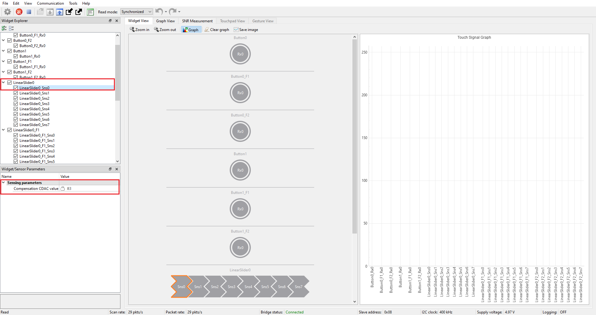

10. Obserse the rawcounts and baseline for three different channels in the graph view as shown in Figure 8.

      **Figure 8. Graph View of CAPSENSE&trade; tuner**

      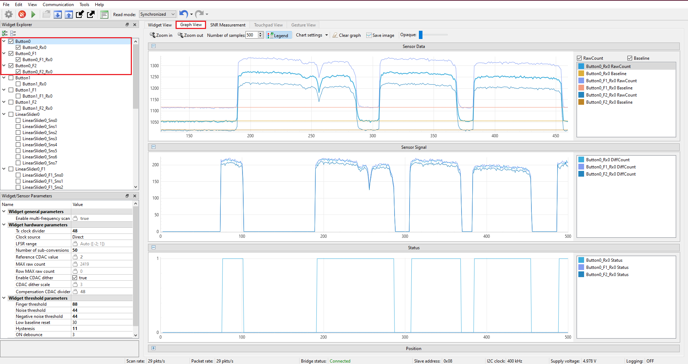

## Noise injection to test the effectiveness of MFS

This section explains how to inject extreme external noise into the system and shows the effectiveness of MFS in reducing false triggers caused by noise injection.

1. Inject a square wave of 1 MHz (same as the Tx Clock frequency) with an amplitude of 1 V into the system at the Rx pin of Button0 Ganged pin 8.1 in the J4 header for [CY8CKIT-041S-MAX](https://www.infineon.com/CY8CKIT-041S-MAX) (pin 1.5 in the J1 header for [CY8CKIT-145-40XX](https://www.infineon.com/CY8CKIT-145-40XX), pin 4.4 in J10 header for [CY8CKIT-045S](https://www.infineon.com/CY8CKIT-045S), pin 4.5 in the J2 header for [CY8CKIT-149](https://www.infineon.com/CY8CKIT-149), and pin 2.5 in the J11 header for [CY8CPROTO-040T](https://www.infineon.com/CY8CPROTO-040T)) using a function generator as shown in Figure 9 for the [CY8CKIT-041S-MAX](https://www.infineon.com/CY8CKIT-041S-MAX) device.

      **Figure 9. Test circuit to inject external noise into the system using function generator for [CY8CKIT-041S-MAX](https://www.infineon.com/CY8CKIT-041S-MAX)**

      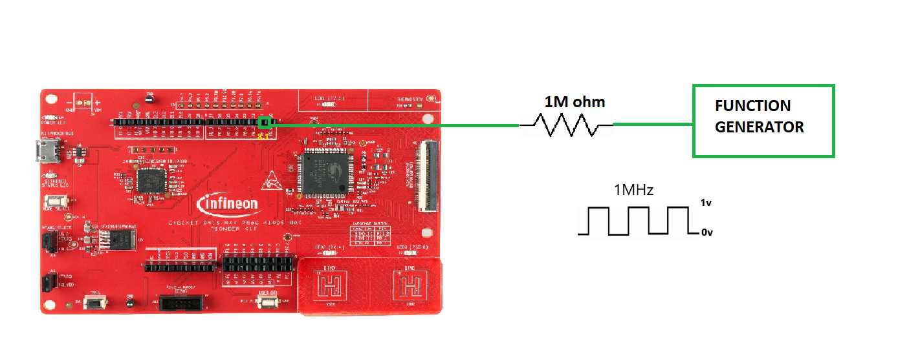

    > **Note:** In the [CY8CKIT-041S-MAX](https://www.infineon.com/CY8CKIT-041S-MAX) kit, the physical GPIO Rx pins for the button widgets are not available on the kit to inject noise. A dummy widget is used to access the GPIO pins available on the board, as shown in Figure 16. Figure 10 shows the scan configuration settings for ganging the Rx pins of the button widgets with the available GPIO pin through the dummy widget.

      **Figure 10. Ganging the Rx pin of button widget with the dummy widget**

      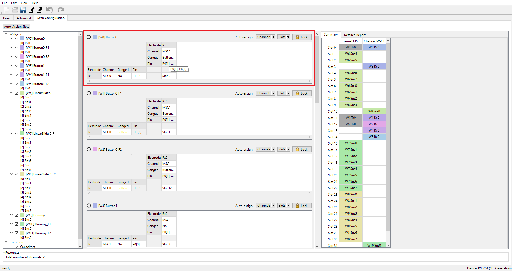

      **Figure 11. Using a Dummy widget for ganging purpose**

      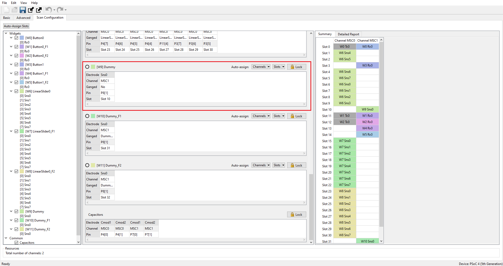

2. When the MFS feature is not enabled, the Button0 sensor falsely triggers due to the induced noise. This can be seen using CAPSENSE&trade; tuner as shown in Figure 12.You can observe this by the flickering of the corresponding LED in the kit, which indicates a false touch.

      **Figure 12. MFS Disabled: Sensor false triggers due to induced noise**

      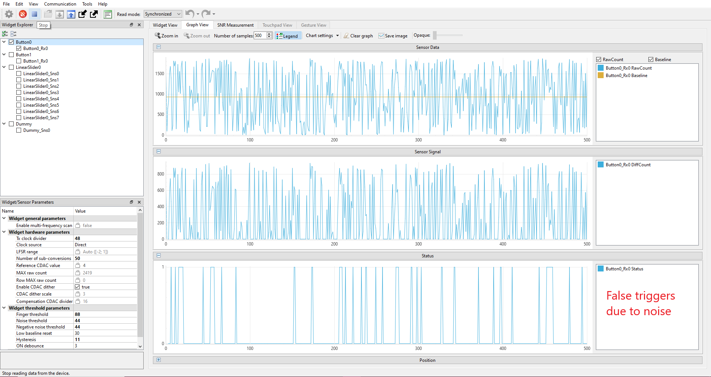

3. Now, MFS is enabled, as shown in Figure 17. The effect of noise on the three different raw counts can be seen using CAPSENSE&trade; tuner, as shown in Figure 13. It is evident that only Channel 0 is affected by the external noise since it is closer to the noise frequency, and the effect of noise on Channel 1 and Channel 2 is minimal because their frequencies differ from the noise frequency.

      **Figure 13. MFS Enabled: Effect of extreme noise on different channels**

      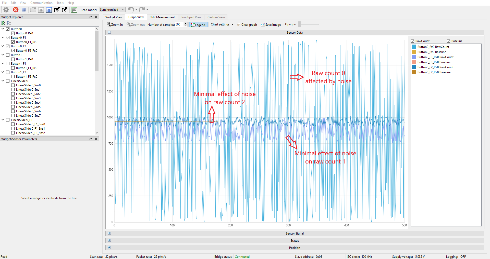

4. Touch the sensors to see the effectiveness of the MFS feature. It is clearly seen from the CAPSENSE&trade; tuner graph view that there are no false triggers due to the induced noise, as shown in Figure 14. The sensor responds well to finger touch.

      **Figure 14. MFS Enabled: No sensor false triggers due to induced noise**

      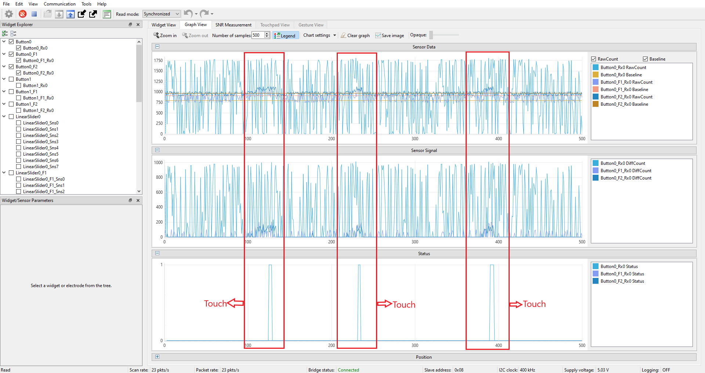

5. As shown in Figure 15, channel 1 and channel 2 respond well to touch, and only channel 0 is affected by the induced noise.

      **Figure 15.  No false triggering when MFS is enabled**

      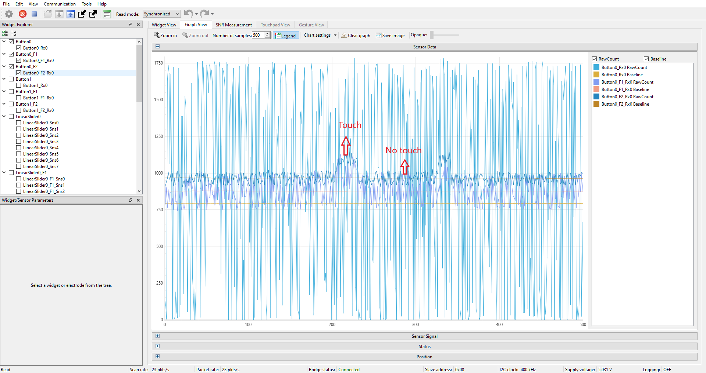

## Parameter Settings
### CAPSENSE&trade; Peripheral

Figure 16 to Figure 20 show the settings for the CAPSENSE&trade; Peripheral.

**Figure 16. CAPSENSE&trade; Peripheral - Basic tab**

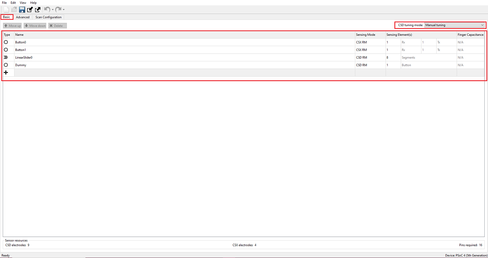

**Figure 17. Enable multi-frequency scan in General settings of Advanced tab**

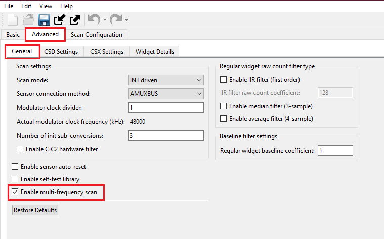

**Figure 18. CSD settings in Advanced tab**

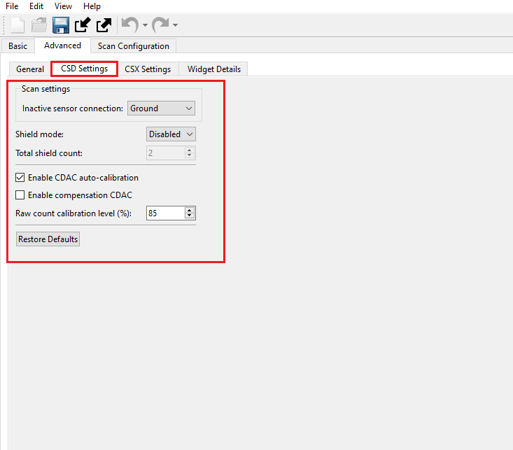

**Figure 19. CSX settings in Advanced tab**

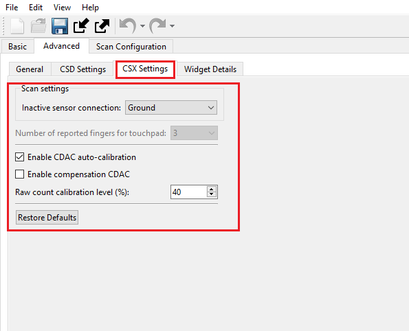

**Figure 20. CAPSENSE&trade; Peripheral Button0 CSX settings**

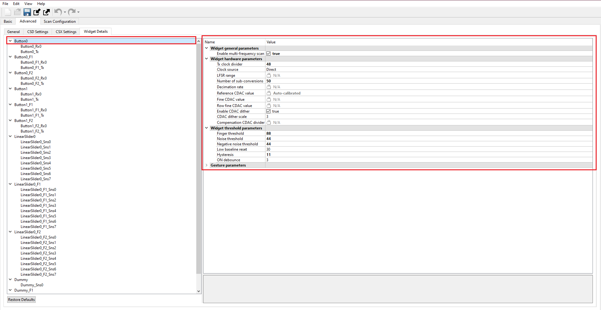

**Figure 21. CAPSENSE&trade; Peripheral Button1 CSX settings**

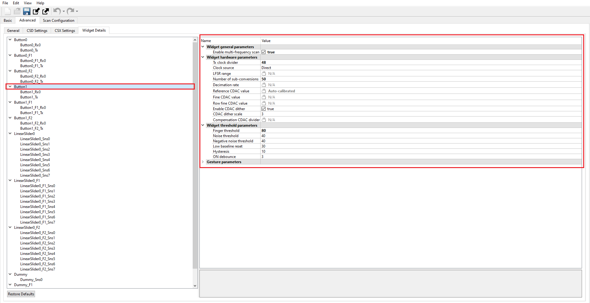

**Figure 22. CAPSENSE&trade; Peripheral Dummy CSD settings**

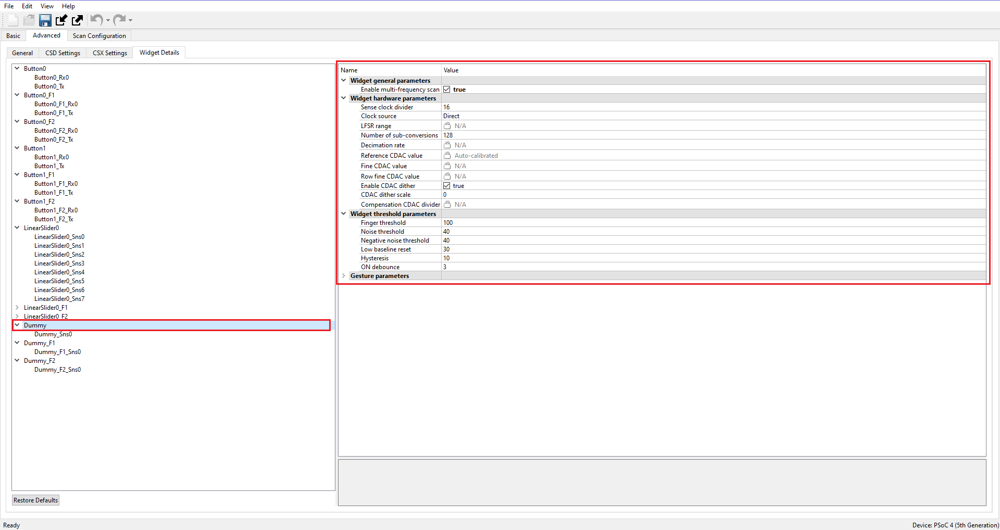

**Figure 23. CAPSENSE&trade; Peripheral LinearSlider0 CSD Settings**

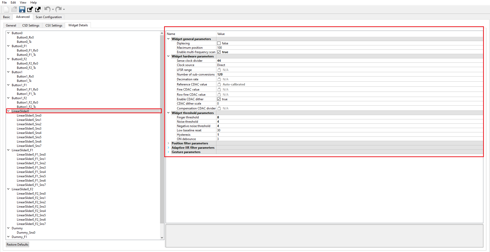

### I2C Peripheral

Figure 24 shows the settings for the EZI2C Peripheral.

**Figure 24. EZI2C Slave Peripheral’s Basic tab**

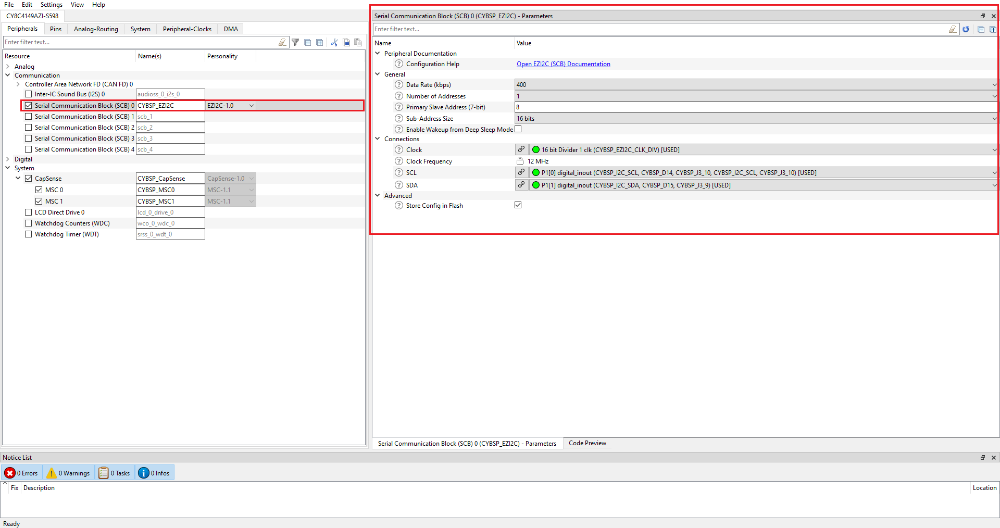


## Debugging

You can debug the example to step through the code.

<details><summary><b>In Eclipse IDE</b></summary>

Use the **\<Application Name> Debug (KitProg3_MiniProg4)** configuration in the **Quick Panel**. For details, see the "Program and debug" section in the [Eclipse IDE for ModusToolbox&trade; user guide](https://www.infineon.com/MTBEclipseIDEUserGuide).

</details>

<details><summary><b>In other IDEs</b></summary>

Follow the instructions in your preferred IDE.

</details>

## Design and implementation

The CAPSENSE&trade; Peripheral is configured with linear slider widgets and button widgets. This code example uses the CAPSENSE&trade; Sigma-Delta (CSD) sensing method for sliders and the Mutual Capacitive Sensing (CSX) sensing method for buttons. Both mutual and self-capacitance have their own advantages. To understand the detailed comparison between them, refer to the application note, AN85951 – PSoC&trade; 4 and PSoC 6 MCU CAPSENSE&trade; Design Guide. When the CAPSENSE&trade; linear slider is touched, the LEDs turn ON to indicate the position of the touch. When a touch is detected on CAPSENSE&trade; buttons, the corresponding LEDs turn ON.

### Resources and settings

**Table 1. Application resources**

| Resource  |  Alias/object     |    Purpose     |
| :------- | :------------    | :------------ |
| SCB (I2C) (PDL) | CYBSP_EZI2C | EZI2C slave driver to communicate with the CAPSENSE&trade; tuner |
| CAPSENSE&trade; | CYBSP_CapSense | CAPSENSE&trade; driver to interact with the CSD hardware and interface CAPSENSE&trade; sensors |
| LED (BSP) | CYBSP_USER_LED, CYBSP_LED_BTN0, CYBSP_LED_BTN1 | User LED to show output |


<br>

## Related resources

Resources  | Links
-----------|----------------------------------
Application notes  | [AN79953](https://www.infineon.com/AN79953) – Getting started with PSoC&trade; 4
Code examples  | [Using ModusToolbox&trade;](https://github.com/Infineon/Code-Examples-for-ModusToolbox-Software) on GitHub
Device documentation | [PSoC&trade; 4 datasheets](https://www.infineon.com/cms/en/search.html#!view=downloads&term=psoc4&doc_group=Data%20Sheet) <br>[PSoC&trade; 4 technical reference manuals](https://www.infineon.com/cms/en/search.html#!view=downloads&term=psoc4&doc_group=Additional%20Technical%20Information)
Development kits | Select your kits from the [Evaluation board finder](https://www.infineon.com/cms/en/design-support/finder-selection-tools/product-finder/evaluation-board).
Libraries on GitHub | [mtb-pdl-cat2](https://github.com/Infineon/mtb-pdl-cat2) – PSoC&trade; 4 Peripheral Driver Library (PDL)<br> [mtb-hal-cat2](https://github.com/Infineon/mtb-hal-cat2) – Hardware Abstraction Layer (HAL) library
Middleware on GitHub | [capsense](https://github.com/Infineon/capsense) – CAPSENSE&trade; library and documents <br>
Tools  | [ModusToolbox&trade;](https://www.infineon.com/modustoolbox) – ModusToolbox&trade; is a collection of easy-to-use software and tools enabling rapid development with Infineon MCUs, covering applications from embedded sense and control to wireless and cloud-connected systems using AIROC&trade; Wi-Fi and Bluetooth&reg; connectivity devices.
<br>


## Other resources

Infineon provides a wealth of data at www.infineon.com to help you select the right device, and quickly and effectively integrate it into your design.

## Document history

Document title: *CE237687* - *PSoC&trade; 4: CAPSENSE&trade; multi frequency scan*

 Version | Description of change
 ------- | ---------------------
 1.0.0   | New code example
 1.1.0   | Added support for new kits
 1.1.1   | Minor README updates


<br>

---------------------------------------------------------

© Cypress Semiconductor Corporation, 2023. This document is the property of Cypress Semiconductor Corporation, an Infineon Technologies company, and its affiliates ("Cypress").  This document, including any software or firmware included or referenced in this document ("Software"), is owned by Cypress under the intellectual property laws and treaties of the United States and other countries worldwide.  Cypress reserves all rights under such laws and treaties and does not, except as specifically stated in this paragraph, grant any license under its patents, copyrights, trademarks, or other intellectual property rights.  If the Software is not accompanied by a license agreement and you do not otherwise have a written agreement with Cypress governing the use of the Software, then Cypress hereby grants you a personal, non-exclusive, nontransferable license (without the right to sublicense) (1) under its copyright rights in the Software (a) for Software provided in source code form, to modify and reproduce the Software solely for use with Cypress hardware products, only internally within your organization, and (b) to distribute the Software in binary code form externally to end users (either directly or indirectly through resellers and distributors), solely for use on Cypress hardware product units, and (2) under those claims of Cypress’s patents that are infringed by the Software (as provided by Cypress, unmodified) to make, use, distribute, and import the Software solely for use with Cypress hardware products.  Any other use, reproduction, modification, translation, or compilation of the Software is prohibited.
<br>
TO THE EXTENT PERMITTED BY APPLICABLE LAW, CYPRESS MAKES NO WARRANTY OF ANY KIND, EXPRESS OR IMPLIED, WITH REGARD TO THIS DOCUMENT OR ANY SOFTWARE OR ACCOMPANYING HARDWARE, INCLUDING, BUT NOT LIMITED TO, THE IMPLIED WARRANTIES OF MERCHANTABILITY AND FITNESS FOR A PARTICULAR PURPOSE.  No computing device can be absolutely secure.  Therefore, despite security measures implemented in Cypress hardware or software products, Cypress shall have no liability arising out of any security breach, such as unauthorized access to or use of a Cypress product. CYPRESS DOES NOT REPRESENT, WARRANT, OR GUARANTEE THAT CYPRESS PRODUCTS, OR SYSTEMS CREATED USING CYPRESS PRODUCTS, WILL BE FREE FROM CORRUPTION, ATTACK, VIRUSES, INTERFERENCE, HACKING, DATA LOSS OR THEFT, OR OTHER SECURITY INTRUSION (collectively, "Security Breach").  Cypress disclaims any liability relating to any Security Breach, and you shall and hereby do release Cypress from any claim, damage, or other liability arising from any Security Breach.  In addition, the products described in these materials may contain design defects or errors known as errata which may cause the product to deviate from published specifications. To the extent permitted by applicable law, Cypress reserves the right to make changes to this document without further notice. Cypress does not assume any liability arising out of the application or use of any product or circuit described in this document. Any information provided in this document, including any sample design information or programming code, is provided only for reference purposes.  It is the responsibility of the user of this document to properly design, program, and test the functionality and safety of any application made of this information and any resulting product.  "High-Risk Device" means any device or system whose failure could cause personal injury, death, or property damage.  Examples of High-Risk Devices are weapons, nuclear installations, surgical implants, and other medical devices.  "Critical Component" means any component of a High-Risk Device whose failure to perform can be reasonably expected to cause, directly or indirectly, the failure of the High-Risk Device, or to affect its safety or effectiveness.  Cypress is not liable, in whole or in part, and you shall and hereby do release Cypress from any claim, damage, or other liability arising from any use of a Cypress product as a Critical Component in a High-Risk Device. You shall indemnify and hold Cypress, including its affiliates, and its directors, officers, employees, agents, distributors, and assigns harmless from and against all claims, costs, damages, and expenses, arising out of any claim, including claims for product liability, personal injury or death, or property damage arising from any use of a Cypress product as a Critical Component in a High-Risk Device. Cypress products are not intended or authorized for use as a Critical Component in any High-Risk Device except to the limited extent that (i) Cypress’s published data sheet for the product explicitly states Cypress has qualified the product for use in a specific High-Risk Device, or (ii) Cypress has given you advance written authorization to use the product as a Critical Component in the specific High-Risk Device and you have signed a separate indemnification agreement.
<br>
Cypress, the Cypress logo, and combinations thereof, WICED, ModusToolbox, PSoC, CAPSENSE, EZ-USB, F-RAM, and Traveo are trademarks or registered trademarks of Cypress or a subsidiary of Cypress in the United States or in other countries. For a more complete list of Cypress trademarks, visit www.infineon.com. Other names and brands may be claimed as property of their respective owners.
